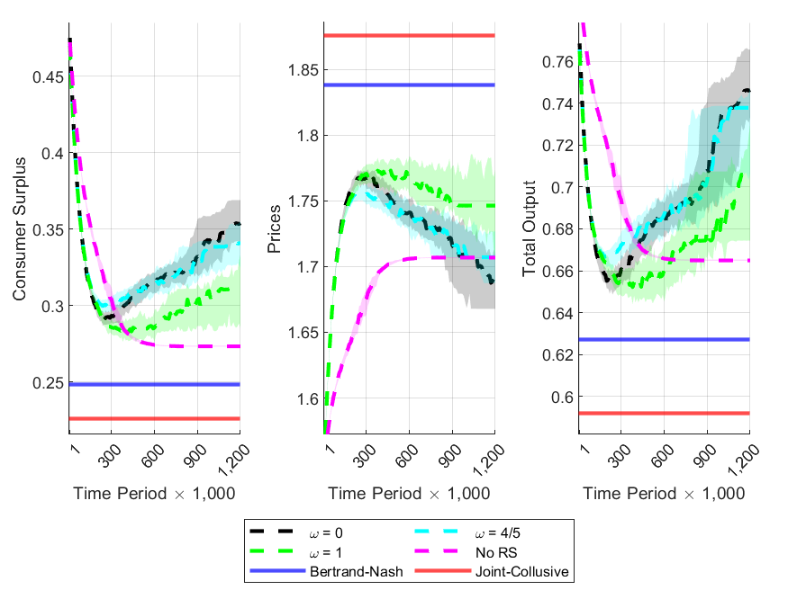

# Algorithmic Pricing, Recommendation Systems, and Competition

Hi there! Thank you for checking out my repository! For the full paper this project is related to, [please click here](link).

## Overview

This project contains an experiment where two reinforcement learning (RL) pricing algorithms engage in Bertrand-Markov pricing competition on a platform that uses a RL-based recommendation system to determine which product to display to certain consumer types. The main result is that autonomous algorithmic collusion is mitigated, and consumers are actually made better off when the recommendation algorithm is present relative to without it. 

## Table of Contents

- [Algorithmic Pricing, Recommendation Systems, and Competition](#project-name)
  - [Overview](#overview)
  - [Table of Contents](#table-of-contents)
  - [Getting Started](#getting-started)
    - [Description of Repository](#description-of-repository)
    - [Prerequisites](#prerequisites)
    - [Installation](#installation)
  - [Results](#results)

  ## Getting Started

  Below are some instructions on how to get the project up and running.

  ### Description of Repository

  1. The folders starting with "LE" correspond to the logit equilibrium fixed point solvers for each underlying demand specification.
  2. The folders starting with "No_RS" correspond to the no recommendation system results meaning the experiment consists of two pricing algorithms engaging on a platform that does not use a RS.
  3. The folders starting with "RS" correspond to the with recommendation system results meaning the experiment consists of two pricing algorithms engaging on a platform that does use a RS.
  4. The folders with "Het" in the name simply mean there is consumer heterogeneity in some way which is directly reflected through the product preference matrix "a".

  ### Prerequisites

  The main dependencies are any recent version of MATLAB and version 11 or greater
  of C++.

  ### Installation

  ```bash
  # Clone the repository
  git clone https://github.com/willbrasic/Algorithmic_Pricing_Recommendation_Systems_Competition.git

  # Navigate to the project directory
  cd Algorithmic_Pricing_Recommendation_Systems_Competition
  ```

  ## Results

  The core result of the paper is that a platform's RS algorithm can successfully and autonomously mitigate tacit algorithmic collusion. The following picture shows the learning trajectories observed for the main outcomes of interest. It illustrates that not only do prices never even reach the Bertrand-Nash benchmark, but consumers are actually better off relative to the no recommendation system case, and this result holds even when the platform places high weight on revenues (higher ω) relative to consumer welfare. Note, the shaded area in the figure represents the interquartile range of each variable.

  
